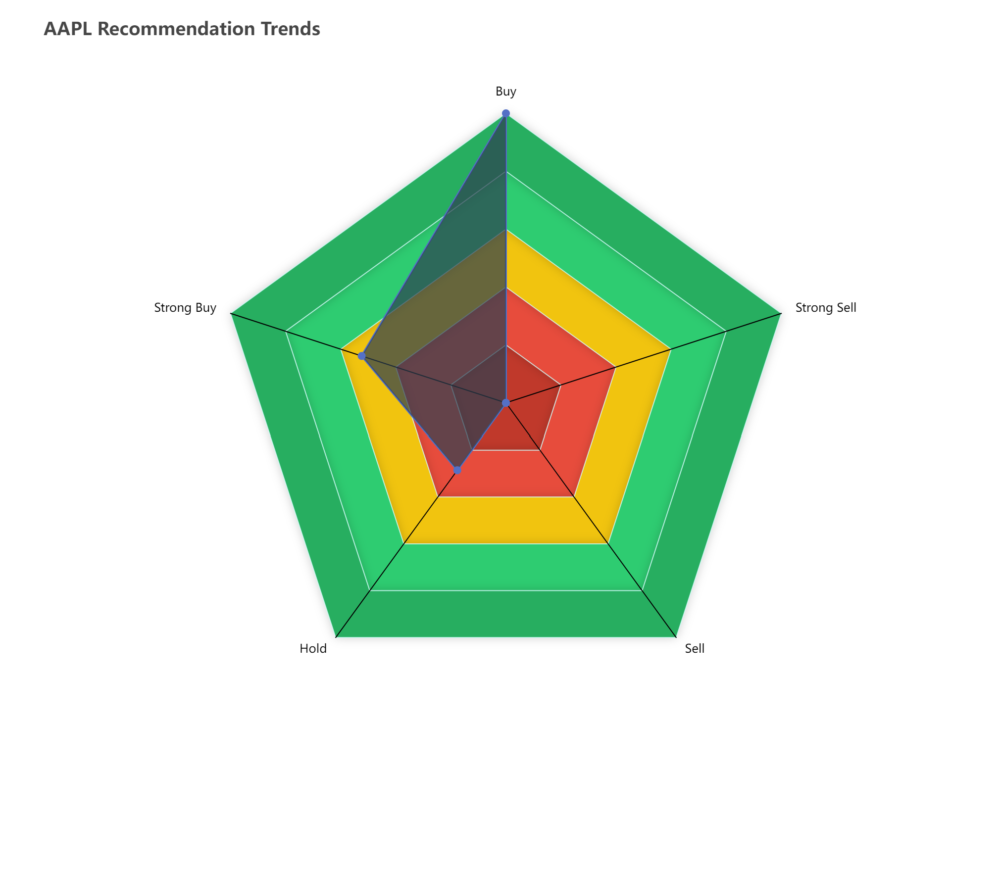
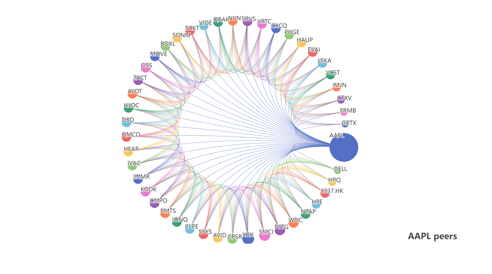
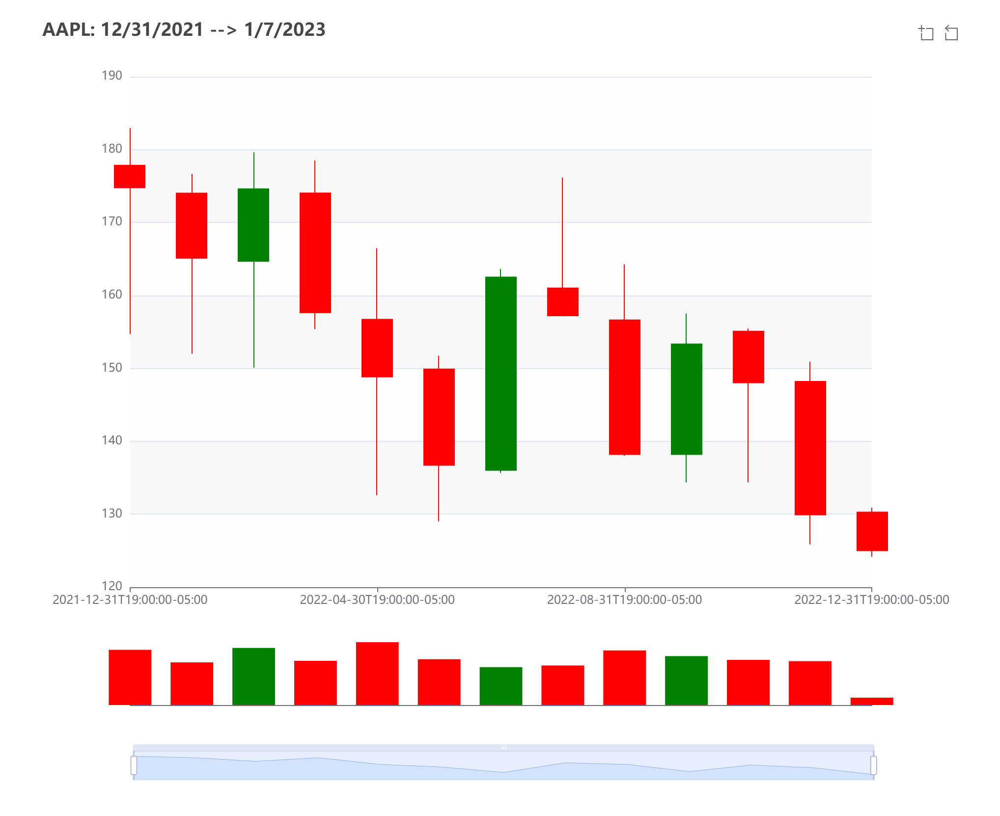
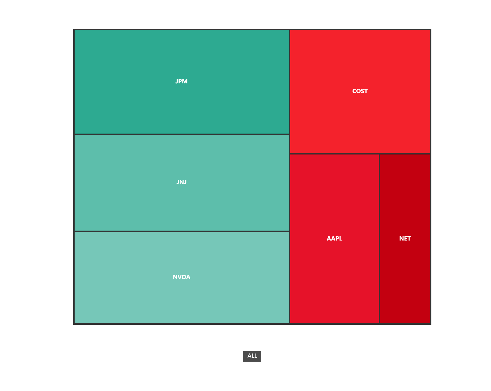

# tulip

[](https://github.com/shoriwe/tulip/actions/workflows/build.yaml)
[](https://codecov.io/gh/shoriwe/tulip)

[](https://goreportcard.com/report/github.com/shoriwe/tulip)

<p align="center">
    
</p>
Extensible market data REST API, made with the intention to interact with multiple market data sources but using the same interface for all.

## Running with Yahoo finance as data source

```shell
tulip yahoo
```

## Dashboard preview


## Components preview

|  |    |
| ------------------------------------------------------------ | --------------------------------------------------- |
|           |  |

## Extending tulip

To extend tulip you can write your own `Source` interface implementations, querying for the necessary data sources you need, such as Yahoo finance API...

## Documentation

| Documentation     | URL                                                          |
| ----------------- | ------------------------------------------------------------ |
| Components        | [docs/Components.md](docs/Components.md)                     |
| OpenAPI           | [docs/api.openapi.yaml](docs/api.openapi.yaml)               |
| Library           | [https://pkg.go.dev/github.com/shoriwe/tulip](https://pkg.go.dev/github.com/shoriwe/tulip) |
| CLI               | [docs/CLI.md](docs/CLI.md)                                   |
| JavaScript client | **Coming soon...**                                           |

## REST API Clients

Coming soon...

## Binaries

You will find pre-build binaries at the [release](https://github.com/shoriwe/tulip/releases) section. If none of these binaries targets your platform use [Go command](#Go-command)

## Docker image

```shell
docker pull ghcr.io/shoriwe/tulip:latest
```

## Building from source

### Go command

```shell
go install github.com/shoriwe/tulip@latest
```

### Local build

```shell
git clone https://github.com/shoriwe/tulip
cd tulip
mkdir -p bin && go build -o bin/ .
```

### Docker image

```shell
git clone https://github.com/shoriwe/tulip
cd tulip
docker build -t tulip .
```

## Coverage

<p align="center">
    
</p>
