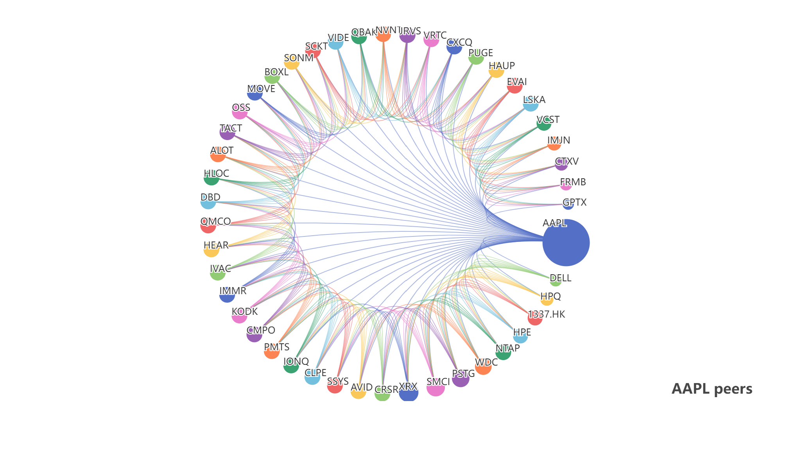
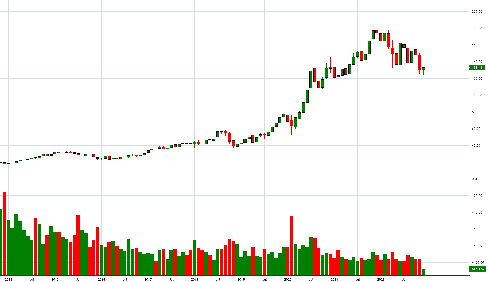
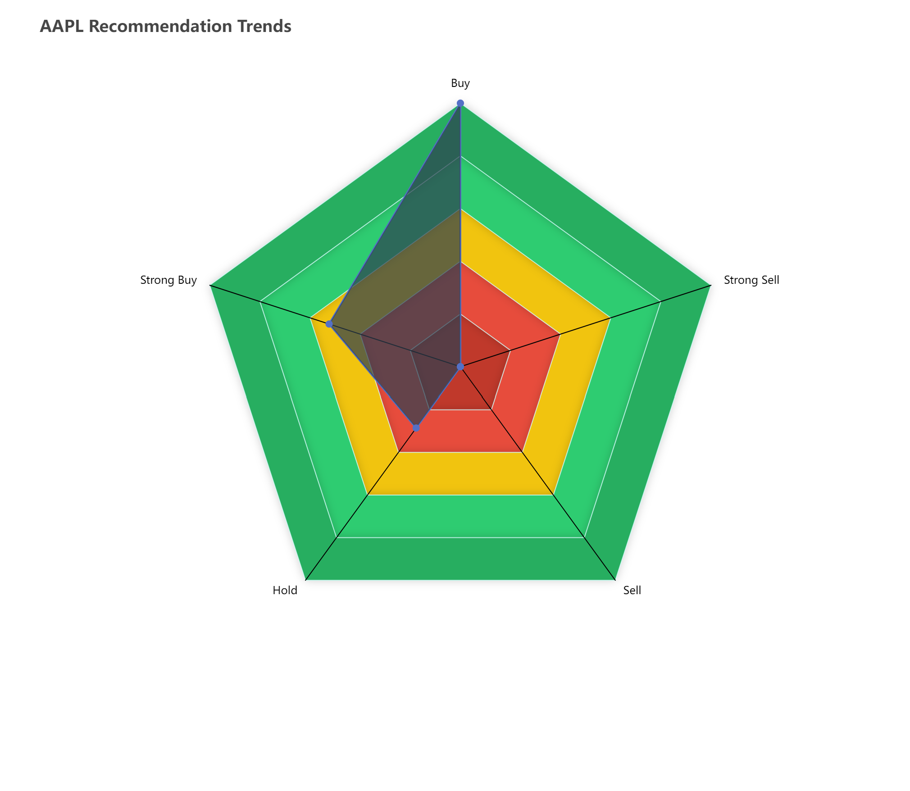
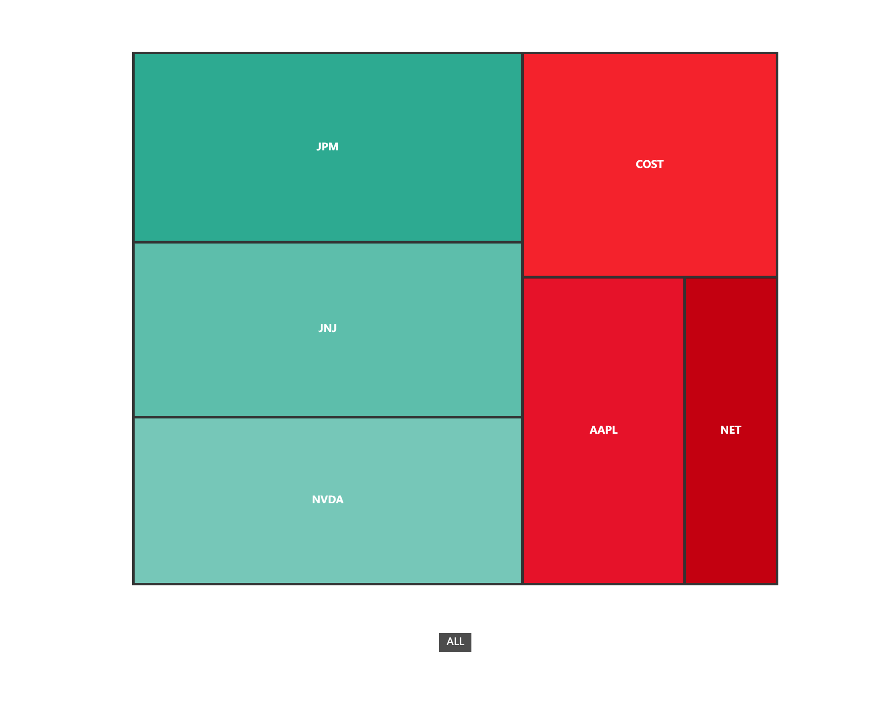

# Components

**tulip** provides easy to use component system that can be easily embedded in your own HTML pages or Markdown documents

## Dashboard

- Route: `/components/dashboard.html`

## Peers

- Route: `/components/peers.html`
- Arguments:

| Query param | Value type | Description                        |
| ----------- | ---------- | ---------------------------------- |
| `symbol`    | string     | Stock/Crypto... symbol to be query |
| `depth`     | number     | Depth of the search                |

- Example embed:

```html
<iframe style="width: 100%; height: 500px;" src="http://YOUR-SERVER:PORT/components/peers.html?symbol=AAPL&depth=500"/>
```

<p align="center">
    
</p>


## Candles

- Route: `/components/candles.html`
- Arguments:

| Query param  | Value type        | Description                                                  |
| ------------ | ----------------- | ------------------------------------------------------------ |
| `upColor`    | string            | Color for Bullish candles; Hex color like: `#FF0000`; Color word like: `red` |
| `downColor`  | string            | Color for Bearish candles; Hex color like: `#FF0000`; Color word like: `red` |
| `symbol`     | string            | Stock/Crypto... symbol to be query                           |
| `resolution` | string            | One of: `1`, `60`, `D`, `M`                                  |
| `last`       | number            | Query the last N candles until today (cannot be used with `from` and `last`) |
| `from`       | UNIX milliseconds | Starting timestamp in UNIX milliseconds                      |
| `to`         | UNIX milliseconds | End timestamp in UNIX milliseconds                           |

- Example embed:

```html
<iframe style="width: 100%; height: 800px;" src="http://YOUR-SERVER:PORT/components/candles.html?symbol=AAPL&resolution=M&last=12"/>
```

<p align="center">
    
</p>

## Recommendation trends

- Route: `/components/recommendation-trends.html`
- Arguments:

| Query param | Value type | Description                        |
| ----------- | ---------- | ---------------------------------- |
| `symbol`    | string     | Stock/Crypto... symbol to be query |

- Example embed:

```html
<iframe style="width: 100%; height: 800px;" src="http://YOUR-SERVER:PORT/components/recommendation-trends.html?symbol=AAPL"/>
```

<p align="center">
    
</p>

## Heatmap

- Route: `/components/heatmap.html`
- Arguments:

| Query param  | Value type        | Description                                                  |
| ------------ | ----------------- | ------------------------------------------------------------ |
| `symbols`    | string            | Comma separated Stock/Crypto... symbols to be query          |
| `resolution` | string            | One of: `1`, `60`, `D`, `M`                                  |
| `last`       | number            | Query the last N candles until today (cannot be used with `from` and `last`) |
| `from`       | UNIX milliseconds | Starting timestamp in UNIX milliseconds                      |
| `to`         | UNIX milliseconds | End timestamp in UNIX milliseconds                           |

- Example embed:

```html
<iframe style="width: 100%; height: 800px;" src="http://YOUR-SERVER:PORT/components/heatmap.html?symbols=AAPL,NET,NVDA,JPM,JNJ,COST&last=6&resolution=M"/>
```

<p align="center">
    
</p>

## Editor

- Route: `/components/editor.html`
- Arguments:

| Query param | Value type | Description                    |
| ----------- | ---------- | ------------------------------ |
| `name`      | string     | File name to be Opened/Created |